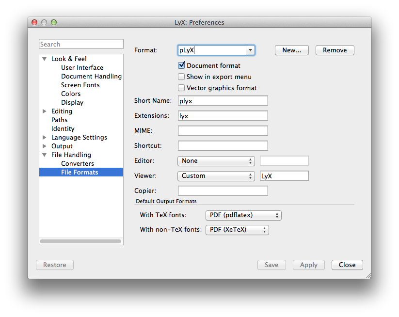
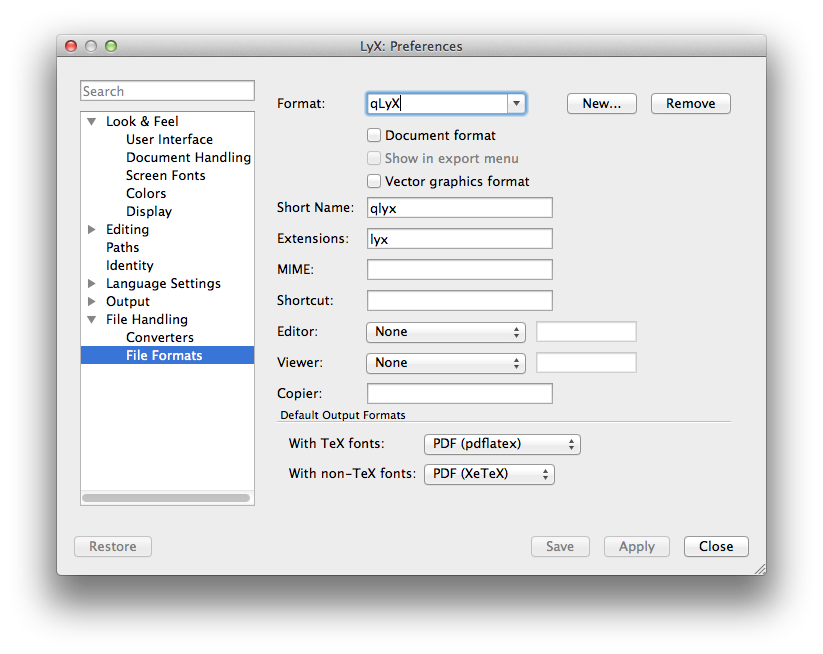
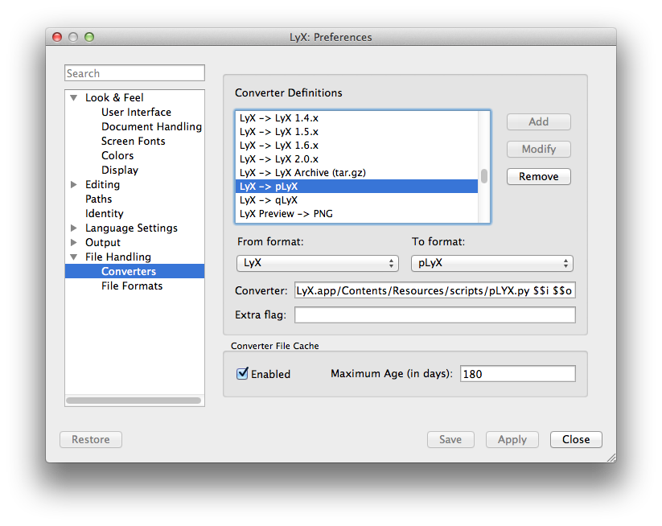
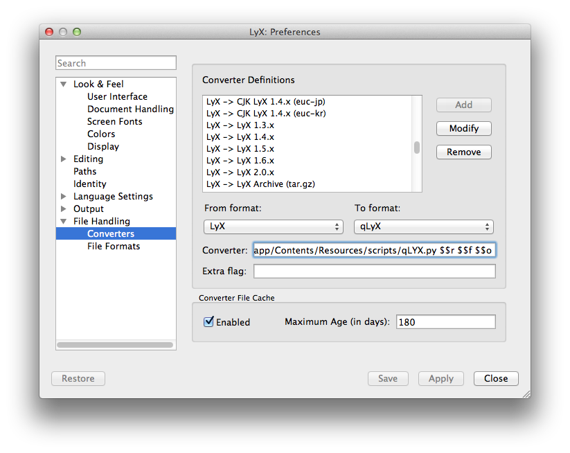
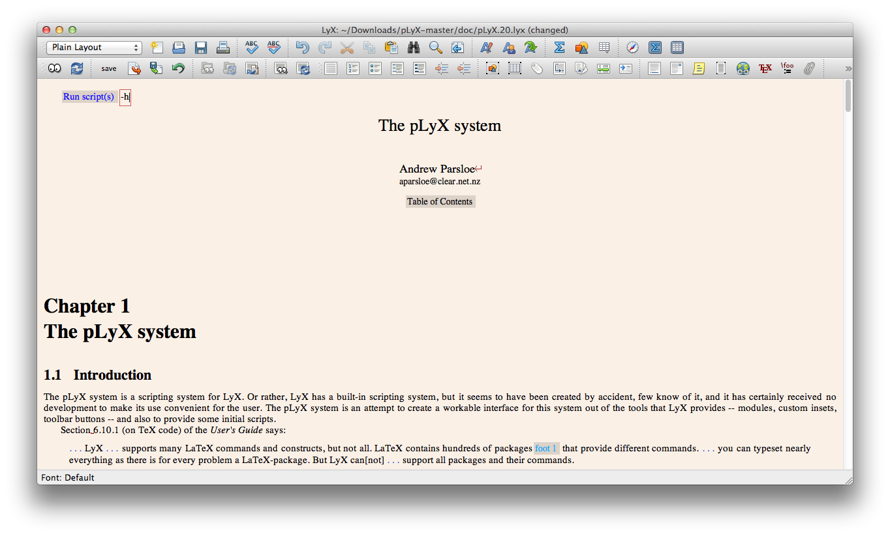
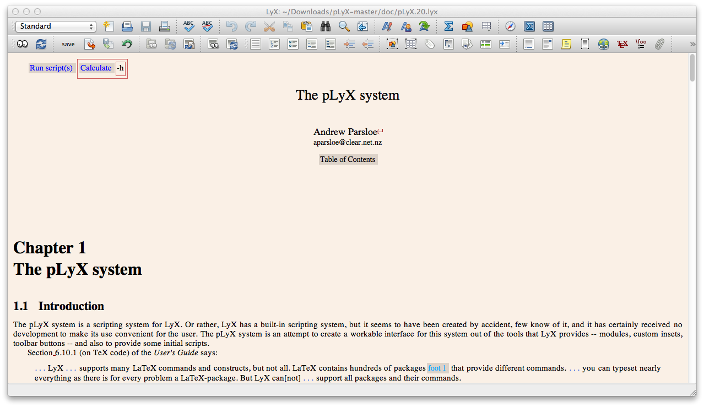
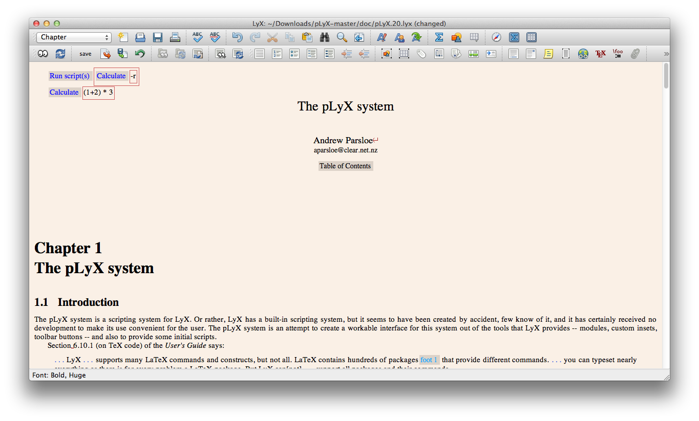
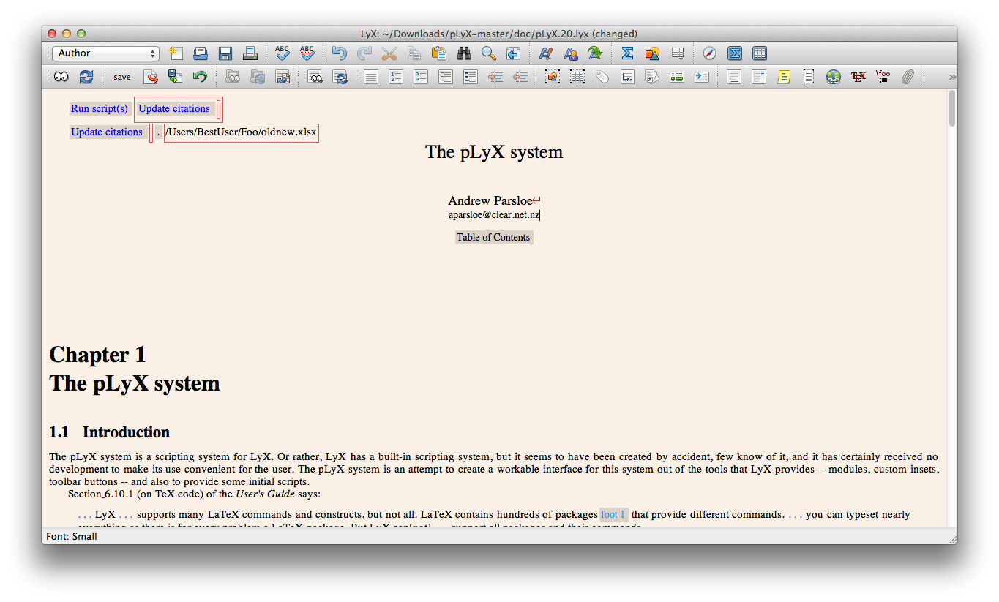

# pLyX System
The pLyX system is a scripting system for LyX. Or rather, LyX has a built-in scripting system, but it seems to have been created by accident, few know of it, and it has certainly received no development to make its use convenient for the user. The pLyX system is an attempt to create a workable interface for this system out of the tools that LyX provides -- modules, custom insets, toolbar buttons -- and also to provide some initial scripts.
# Docs
- [Installation](#installation)
    - [Windows](#windows)
    - [Mac OS X](#mac-os-x)
    - [Linux](#linux)
    - [Setup LyX](#setup-lyx)
- [Using pLyX](#using-plyx)
    - [Add module](#add-module)
    - [Invoke help for pLyX](#invoke-help-for-plyx)
    - [Invoke help for child script](#invoke-help-for-child-script)
    - [Invoke child script](#invoke-child-script)
    - [Invoke child script with argument](#invoke-child-script-with-argument)
    - [Run script](#run-script)
    - [Revert changes](#revert-changes)

## Installation
### Windows
* Get package:
  * download zipped version of this package [here](https://github.com/alexsanduk/pLyX/archive/master.zip).
  * unzip the archive to a convenient location (for example `My Documents`)
  * Launch command prompt and go to the root of the unzipped folder (should contain file `requirements.txt`).
* Python:
  * Download and run the Python 2.7 installer (either the "Windows x86 MSI Installer" or "Windows x86-64 MSI installer").
  * Open the Windows Start menu.
  * Search for "Edit the system environment variables", and then click it.
  * Click `Environment Variables`.
  * Select `PATH` in the `System variables` section.
  * Click `Edit`.
  * Add `;C:\Python27;C:\Python27\Scripts` to the end of the list (the paths are separated by semicolons). For example: `C:\Windows;C:\Windows\System32;C:\Python27;C:\Python27\Scripts`.
  * Verify that it worked by opening your command prompt and entering `python`. You should see the `>>>` prompt.
  * Install `pip` by opening command prompt and entering `easy_install pip`.
  * Installed required packages for Python by running `pip install -r requirements.txt`.
* Copy files:
  * copy contents of `doc` folder to `C:\Users\<UserName>\AppData\Roaming\LyX2.1\doc`
  * copy contents of `layouts` folder to `C:\Users\<UserName>\AppData\Roaming\LyX2.1\layouts`
  * copy contents of `images` folder to `C:\Users\<UserName>\AppData\Roaming\LyX2.1\images`
  * copy contents of `scripts` folder to `C:\Users\<UserName>\AppData\Roaming\LyX2.1\scripts`
  * copy contents of `ui` folder to `C:\Users\<UserName>\AppData\Roaming\LyX2.1\ui`
* You ready to [setup LyX](#setup-lyx).

### Mac OS X
* Get package:
  * download zipped version of this package [here](https://github.com/alexsanduk/pLyX/archive/master.zip).
  * unzip the archive to a convenient location (for example `Documents`).
  * Launch terminal and go to the root of the unzipped folder (should contain file `requirements.txt`).
* Python:
  * Check that you have Python installed by running `python` in terminal. Normally Mac OS X comes with Python preinstalled.
  * Check that you have pip installed by running in terminal `pip freeze`. If not install with `sudo easy_install pip`.
  * Installed required packages for Python by running `sudo pip install -r requirements.txt`.
* Copy files:
  * copy contents of `doc` folder to `/Applications/LyX.app/Contents/Resources/doc`
  * copy contents of `layouts` folder to `/Applications/LyX.app/Contents/Resources/layouts`
  * copy contents of `images` folder to `/Applications/LyX.app/Contents/Resources/images`
  * copy contents of `scripts` folder to `/Applications/LyX.app/Contents/Resources/scripts`
  * copy contents of `ui` folder to `/Applications/LyX.app/Contents/Resources/ui`
* You ready to [setup LyX](#setup-lyx).

### Linux
* Get package:
  * download zipped version of this package [here](https://github.com/alexsanduk/pLyX/archive/master.zip).
  * unzip the archive to a convenient location (for example `Documents`).
  * Launch terminal and go to the root of the unzipped folder (should contain file `requirements.txt`).
* Python
  * Check that you have Python installed by running `python` in terminal. Normally Linux comes with Python preinstalled.
  * Check that you have pip installed by running in terminal `pip freeze`. If not install with `sudo apt-get install python-pip`.
  * Installed required packages for Python by running `sudo pip install -r requirements.txt`.
* Copy files:
  * copy contents of `doc` folder to `/home/<UserName>/.lyx/doc`
  * copy contents of `layouts` folder to `/home/<UserName>/.lyx/layouts`
  * copy contents of `images` folder to `/home/<UserName>/.lyx/images`
  * copy contents of `scripts` folder to `/home/<UserName>/.lyx/scripts`
  * copy contents of `ui` folder to `/home/<UserName>/.lyx/ui`
* You ready to [setup LyX](#setup-lyx).

### Setup LyX
This step you will have to do once to configure LyX properly.
* open LyX.
* define File format for `pLyX` in `Tools (LyX on Mac) -> Preferences -> File Handling -> File Formats`:
  * click `New` button and enter `pLyX` in the Format box;
  * set the `Document format` check box;
  * enter `plyx` in the `Short Name` box;
  * enter `lyx` in the `Extension` box;
  * under `Viewer` choose `Custom` and enter `LyX` in the box on the right;
  * Click `Apply`.

* define File format for `qLyX` in `Tools (LyX on Mac) -> Preferences -> File Handling -> File Formats`:
  * click `New` button and enter `qLyX` in the Format box;
  * enter `qlyx` in the `Short Name` box;
  * None of the other check boxes or slots should be filled;
  * Click `Apply`.

* define converter from LyX to pLyX in `Tools (LyX on Mac) -> Preferences -> File Handling -> Converters`:
  * by scrolling in the list `From format` select `LyX`;
  * by scrolling in the list `To format` select `pLyX`;
  * enter in `Converter` box:
    * for Windows: `python "C:\Users\<UserName>\AppData\Roaming\LyX2.1\scripts\pLyX.py" $$i $$o`;
    * for Mac OS X: `python /Applications/LyX.app/Contents/Resources/scripts/pLyX.py $$i $$o`;
    * for Linux: `python /home/<UserName>/.lyx/scripts/pLyX.py $$i $$o`;
  * click `Add` and `Apply`.

* define converter from LyX to qLyX in `Tools (LyX on Mac) -> Preferences -> File Handling -> Converters`:
  * by scrolling in the list `From format` select `LyX`;
  * by scrolling in the list `To format` select `qLyX`;
  * enter in `Converter` box:
    * for Windows: `python "C:\Users\<UserName>\AppData\Roaming\LyX2.1\scripts\qLyX.py" $$i $$o`;
    * for Mac OS X: `python /Applications/LyX.app/Contents/Resources/scripts/qLyX.py $$i $$o`;
    * for Linux: `python /home/<UserName>/.lyx/scripts/qLyX.py $$i $$o`;
  * click `Add` and `Apply`.

* Choose in menu `Tools -> Reconfigure`

## Using pLyX

### Add module
In each file you are working with add module `pLyX` in `Document -> Settings -> Modules`:
* choose `pLyX` in list `Available` and click `Add`;
* click `Apply`;
* verify that in the menu `Insert -> Custom Insets` you have new insets starting with `.` (i.e. `.Run script(s)[]`).

### Invoke help for pLyX
* insert custom inset `.Run script(s)[]` with `-h` at the begging of file;

* [run script](#run-script).

### Invoke help for child script
* insert custom inset `.Run script(s)[]`;
* inside `.Run scripts[]` insert custom inset `.calculate formula` with `-h` flag;

* [run script](#run-script).

### Invoke child script
This is an example of invoking the script that performs simple calculations:
* insert custom inset `.Run script(s)[]`;
* inside `.Run scripts[]` insert custom inset `.calculate formula` with additional flags if needed;
* insert custom inset `.calculate formula` anywhere inside document;

* [run script](#run-script).

### Invoke child script with argument
This is an example of invoking the script that updates citations according to excel file provided:
* insert custom inset `.Run script(s)[]`;
* inside `.Run scripts[]` insert custom inset `.update citations` with additional flags if needed;
* insert custom inset `.update citations` anywhere inside document;
* insert custom inset `.[argument]` right after with absolute path specified (on Windows, path should be with slash rather than backslash, for example: `C:/Users/reevek/Documents/ED/NewBibtexKeys.xls`);

* [run script](#run-script).

### Run script
In the following it is assumed that in toolbar you have following buttons 

Several buttons needs to be pressed for script(s) to run:
* First press button `Save`. This will backup your current document;
* Press  to run the script(s) over the document;
* Press  to load document back into LyX.

### Revert changes
In the following it is assumed that in toolbar you have following buttons 

You can't undo changes made by pLyX with regular undo command.
To revert changes do the following steps:
* Press  to load document from backup;
* Press  to load document back into LyX.
